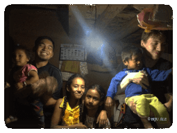

# ABOUT

My name is _Biju Ale_. I am a John 3:16 Christian. I am interested in Philosophy, Science, and Theology. Welcome to my website, where I try to write about my formative experiences and occasional musings.

Presently, I support a consulting firm called [Scott Wilson Nepal](https://swnepal.com.np/biju-ale/), in research, monitoring, learning, and evaluation of myriad developmental projects.

More about me...

- I side by the marginalized, minorities, and the deprived and strive to empower them to the best of my ability.
- I love dogs very much.
- Some favourite authors: CS Lewis, JRR Tolkien, Richard Swinburne, Pascal, William L Craig, & J P Moreland.
- Some favourite musicians: Symphony X, Creed, Buckethead, Kenny G, Stravinsky, & Beethoven.
- My favorite shows are Batman Animated Series (1992), X-Men (1992), Full house (1987), Freaks & Geeks (1999), and Robert L. Kuhn's Closer to Truth.
- I also love to travel, hike, cycle, take pictures, play the guitar, and do arts and crafts.
- Errorneous ideas and phenomena: logical fallacies, naturalism, scientism, wokeism, & human sin and evil.
- I am nostalgic about the lovely 90s and the early 2000s. Would it be possible bring 'em back and live in one?
- Me, elsewhere on the web: [Academia.edu](https://independent.academia.edu/BijuAle/), [LinkedIn](https://linkedin.com/in/bijuale/), [Facebook](https://fb.com/BijuAle), [Instagram](https://instagram.com/bijuale__)

