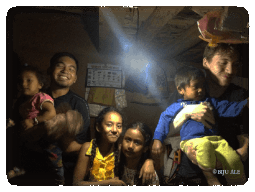

# ABOUT

Welcome to my website. Thanks for stopping by :) Here, I write about my learnings, largely in philosophy, formative experiences, and some occasional musings.

My name is _Biju Ale_. I am a Jesus-loving millenial, hailing from Nepal. Adhering to the Christian worldview, I believe in the objectivity of Truth, Morality, & Beauty. I am highly interested in Philosophy, Theology, & Sciences.

More about me..

- I side by the marginalized, minorities, and the deprived and strive to empower them to the best of my ability.

* I love dogs very much.

- Some of my favorite authors are Dostoyevsky, Pascal, CS Lewis, JRR Tolkien, Richard Swinburne, William L Craig, & JP Moreland.

* I adore music by Stravinsky, Beethoven, Symphony X, Creed, Buckethead, Kenny G, & Karna Das (a legendary Nepali singer).

- I love to hone my aesthete disposition.

* I love to watch old classic flicks akin to Hitchcock's. My favorite shows are Batman, X-Men, Full house, Freaks & Geeks, and Robert L. Kuhn's Closer to Truth.

- I love to travel, take pictures (with my steadfast phone), arts and crafts, cycling (I rode a hardtail - 'Trek 4900' - daily ~20km for over six years), & hiking.

* Some things I avert and abhor: postmodernism, scientism, jingoism, cronyism, logical fallacies, discrimination, despotism, radicalism, collusion, & sin.

- I miss the beloved 90s.

