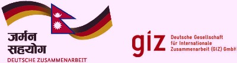
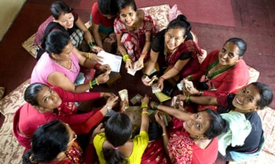
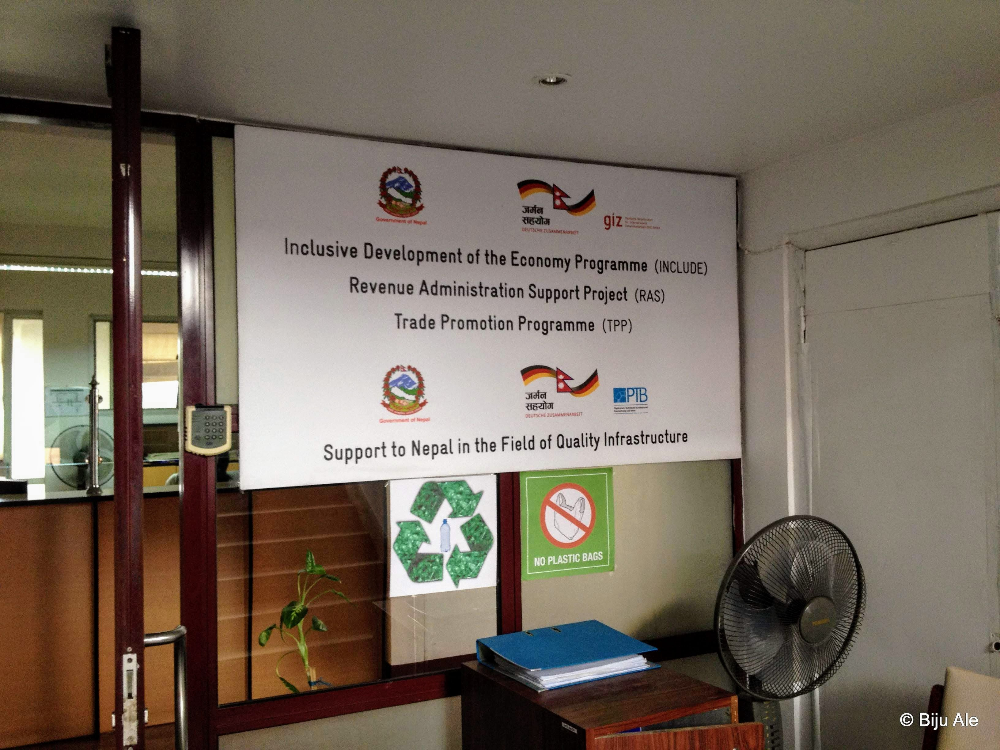
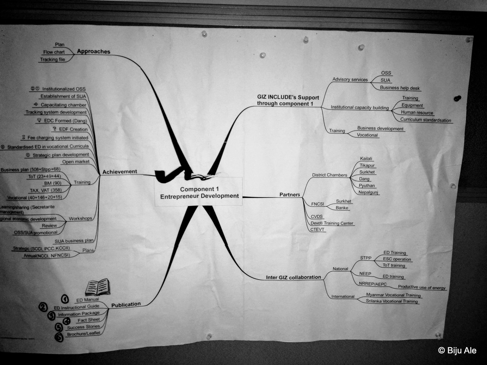
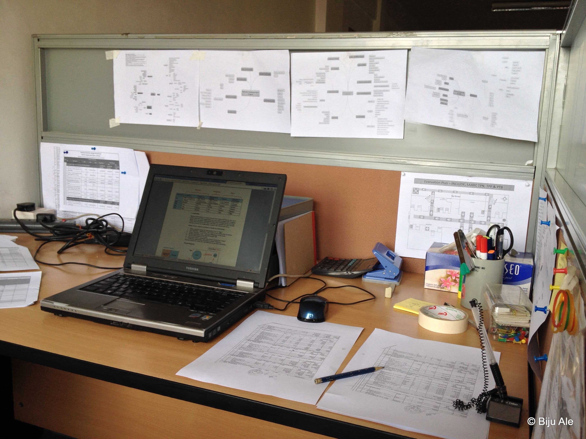

# Acknowledgement

My immense gratitude goes to the prestigious agency GIZ and the German government for opening internship opportunities for prospective students like, to engage in learning by doing in their programmes and project. Special gratitude goes to my respected supervisor Kabir Kumar Chitrakar for accepting me and eventually guiding me throughout my internship period. I am indebted to him for his invaluable advices, constructive feedback, encouragement, and the untiring support.

I want to thank Chakrapani Timalsina, for initially clarifying the concepts, the approaches, and the working modality of INCLUDE in relevance to our sector. Similarly, it was a great learning experience to coordinate and work with Yagya Raj Joshi. Also, I am grateful to Maniram Bhandari who helped me while I was at the regional office in Nepalgunj.

I am grateful to the programme managers, the deputy chief Nibedan Baidya and the chief Ellen Kallinowsky, for kindly following up to check on my\working cum learning status.

Thanks to all the individuals from the different programs (situated in Nepalgunj, Lalitpur or other regions) namely SAARC-TPN, PTB, TPP, IN-MAPS, INCLUDE-Innovation, INCLUDE-Public Sector, INCLUDE-Private and Cooperative sector, INCLUDE-Value Chain (Chiuri, Honey and Dairy), INCLUDE-INMAPS, RMO, RAS and also thanks to all the individuals from the team of drivers, guards, support staffs, administration, finance, MandE, communication and PR. Likewise to the consultants, the advisors, the development workers and the CIM-Experts. All of them including the programmes' respective interns have given me their substantial support\ at some point during my tenure.

Laslty, I cannot thank enough the lamb of God, the holy spirit, and the Jehova. His love and providence has manifested in this internship.

# Introduction

## GIZ

              Formation 1 Jan, 2011 (Predecessor gtz formed in Dec 12, 1974)
                   Type  Governmental
           Legal Status  GmbH
                Purpose  Development aid
            HQ Location  Bonn and Eschborn, Germany
     Executive director  Tanja Gönner
       Number of Staffs  17,185 (as of 2014)
                Website  [www.giz.de](www.giz.de)

Snapshot information on giz

The Deutsche Gesellschaft für Internationale Zusammenarbeit (GIZ) GmbH (German Federal Enterprise for International Cooperation) or GIZ is an international enterprise owned by the German Federal Government, operating in many fields across more than 130 countries. It primarily works with states, state agencies, and the private sector. Its headquarters are located in Bonn and Eschborn, Germany. The organisation was established on 1 January 2011 through a merger of the three German organisations Deutscher Entwicklungsdienst (DED), Deutsche Gesellschaft für Technische Zusammenarbeit (GTZ), and Internationale Weiterbildung und Entwicklung (InWEnt).

The GIZ main activities in foreign developing countries are focusing on sustainable development and resource management. They are summarised below.

- Economic Development and Employment (including services such as vocational training, economic policy advice, financial systems development or private sector promotion
- Government, Democracy and Poverty Reduction (including services and working fields such as development-oriented emergency aid, peace building and crisis prevention, governance, sustainable urban development or structural poverty reduction)
- Education, Health and Social Security (including working fields such as education, development-oriented drug control, promotion of children and young people or HIV/AIDS prevention)
- Environment and Infrastructure (including activities such as waste, energy and water management, natural resource management, transport and mobility, implementing international environmental regimes or environmental policy, climate change-related capacity building)
- Agriculture, Fisheries and Food (including services such as coastal zone management, land management, market-oriented farming and food systems, policy advice on agriculture and rural development or securing livelihoods in marginal rural areas)

## GIZ in Nepal

GIZ has been active in Nepal since 1975 on behalf of the German Federal Ministry for Economic Cooperation and Development (BMZ) and opened its own office in the capital, Kathmandu, in 1979. At present 25 seconded staff and about 250 national staff, 9 CIM experts and 24 development workers, 6 of them working under the auspices of the Civil Peace Service (CPS), are working for us in Nepal.

     Country Director  Roland F. Steurer (as of 2014)
                Email  giz-nepal@giz.de
              Address  Sanepa, Lalitpur, Nepal

GIZ Nepal Contact

Nepal is well on the way to becoming a democracy. When ten years of civil war came to an end, elections to the Constituent Assembly were held in 2008. Following the abdication of the king, Nepal was declared a democratic republic. After the Constituent Assembly was dissolved in mid-2012 without reaching agreement, new elections to the assembly took place in November 2013. A transitional administration is leading the country until a new government is formed.

As a result of the conflict, Nepal's economic growth lags far behind the booming economies of its neighbours. One third of the population lives below the poverty line. Nepalese have lowest life expectancy in Asia and almost half of all Nepalese children are chronically undernourished. Since the early 1990s, child and maternal mortality have both been reduced by half, yet even today, only about one fifth of births are assisted by a doctor or midwife.

Nevertheless, it is expected that the country, with the help of the international community and the efforts of its own government, will be able to achieve almost all the Millennium Development Goals. School enrollment rates, for instance, are very encouraging. Today, nine children out of ten are able to go to school.

The restoration of democracy has raised great hopes that the population's social and economic situation will improve. The progress made and the elections, which have generally been seen to be free and fair, should not, however, blind us to the fact that the country is still facing its greatest challenges.

The goals of our work there are to reduce poverty, to ensure inclusive development and to improve the country's economic and political framework. The priority areas of Nepalese-German cooperation are the following.

- sustainable economic development and trade
- renewable energies and energy efficiency
- health

Additionally, a number of cross-boarder programmes are supported for the improvement of regional resource management in the Hindukush-Himalayas. Support is also provided with regard to Local Governance issues, Peace Building through the Civil Peace Service and supporting earthquake victims through a Recovery Programme.

## INCLUDE - Inclusive Development of the Economy Programme

### Overview

           Programme title  INCLUDE - Inclusive Development of the Economy
            Commisioned by  German Federal Ministry for Economic Cooperation and Development
                   Country  Nepal
     Lead Executing Agency  Ministry of Industry (MOI)
              Overall term  2008 to 2016 (as of 2014)
         Programme manager  Ellen Kallinowsky
                   Contact  ellen.kallinowsky.giz.de

Snapshot information of INCLUDE

The Inclusive Development of the Economy (INCLUDE) Programme is a joint Nepali-German programme under the guidance of the Nepal Ministry of Industry (MoI) and with Technical Assistance by the Deutsche Gesellschaft für Internationale Zusammenarbeit (GIZ) GmbH, acting on behalf of the German Federal Ministry for Economic Cooperation and Development (BMZ). Initiated in 2008, the current programme phase runs from 2014-2016 with the objective that selected actors from the public, private and cooperative sector increasingly perform their roles in promoting a socially balanced economic development.

INCLUDE is the anchor programme in the joint Nepali-German priority area of Sustainable Economic Development and Trade. As such, the programme particularly aims at systemic improvements that will allow a change in the set-up and performance capability of the partners and further actors. In the five project districts (Kailali, Surkhet, Dang, Pyuthan and Banke), the programme promotes its partner institutions in improving the public-private dialogue as well as by upgrading the intuitional capacities of and developing services for selected partners.

### Primary Objective

Selected actors from the public, private and cooperative sector increasingly preform their roles in promoting socially balanced development.

### Approach

The project supports the Nepalese Ministry of Industry in promoting inclusive development of the economy in Banke, Dang, Kailali, Pyuthan and Surkhet, five districts in central and far-western Nepal. The project strengthens partner institutions by improving the public--private dialogue. It promotes the economic inclusion of target groups through support for selected value chains such as honey, medicinal aromatic plants and dairy products. The project additionally aims to transfer successful local practices to the national level, develop innovative approaches to improved cooperation among partners, and promote socially responsible entrepreneurship. The institutional capacity of selected partners is to be expanded and services of public institutions developed. These aspects of the project are intended to promote inclusive growth and employment.

### Results achieved as of 2014

Local structures, as well as the resources and public services of the chambers of industry and commerce at the district level, have been improved. A particular milestone was the establishment of information and service centres for business start-ups and business promotion at eight selected chambers. With support from these centres, more than 1,500 Nepalese citizens had set up or expanded their own companies by November 2013.

Between 2012 and 2013, more than 3,500 producers were reached with support from the value chains. 70% of these producers were from disadvantaged groups, and 55% of those receiving support from the project have been women.

The findings of the first business climate study to be conducted enhanced public--private dialogue in the target districts and were incorporated into development plans.

### Phase II (2014-2016)

#### Partners

- Lead Executive Agency
- Ministry of Industry (MOI)
- Implementing agency (National Level)
- MoCPA (DoC)
- FNCCI
- FNCSI
- NCF/NACCF
- DCSI
- CSIDB
- FNBK/NBCCU
- JABAN
- Implementing agency (District Level)
- Public Sector (CSIDB, DCSI)
- Coopeartives and their apex bodies
- Private Sector (DCCI, FNCCI, NCF, FNCSI, NEHPA, JABAN)

#### Programme components and outputs

- Capacity development of MoI, MoCPA and their local structures (DCSI, CSIDB, DoC) for better fulfillment of their tasks for socially balanced development. PPD support at national and district level.
- Improvement of cooperation among FNCCI, FNCSI and NCF with their respective local counterparts.
- Improvement of services offered by chambers as well as cooperative associations and trade federations.
- Value chain development in target districts: Honey, MAPs (especially butternut), Dairy.
- Innovative approaches for promoting socially balanced economic growth (Tourism, private sector cooperation).

#### Indicators of Component C + D

- Improvement of services offered by chambers as well as cooperative associations and trade federations.
  1.  The benefit or services of the national offices of FNCCI, FNCSI and NCF for the respective district organizations are demonstrated three times per organization documented by statements by managers.
  2.  Three of the changes successfully piloted at district leve (structures, instruments, processes) by FNCCI, FNSI and NCF are also implemented by sub-organizations in 5 non- INCLUDE districts.
- Value chain development in target districts: Honey, MAPs (especially butternut), Dairy.
  1.  5% of the costs are covered by user fees at each provider promoted by the project.
  2.  40 consultations are conducted per month by the organization.
  3.  50% of the persons who use services in return for fees are exempted.

#### Target beneficiaries

- Poor
- Ultra-poor
- Marginalised
- Women

#### Key areas of Intervention

- Management Information System (MIS)
- Public Private Dialogue (PPD)
- Donor Coordination.
- Improvement of linkages between district and national level
  organisations.
- Human Capacity Development/Enhancement
- Institutional Development/Enhancement

## The Internship

         Tenure period  18 Feb, 2014 to 18 Aug, 2014
                Agency  GIZ
             Programme  INCLUDE
             Component  C+D
               Station  Kathmandu
            Work hours  09:00 to 17:00 (5 days a week)
            Supervisor  Kabir Kumar Chitrakar (Senior Programme Officer)
                 Email  biju.ale\@giz.org.np
     Programme Address  Pulchowk, Lalitpur, Nepal
       Programme email  include\@giz.org.np
       Programme phone  +977-01-5554197

Snapshot informataion on the internship.

GIZ opens internship opportunities to the students across Nepal. TheGermna-billateral development support steered by the Nepalese governmentand technically supported by GIZ runs a dozen or so projects in Nepal.Each project and the GIZ HQ in Nepal has their own internship openingsevery year.

I applied to intern at GIZ's INCLUDE programme on February 5 2014. Theopening was announced in the national daily 'The Himalayan Times'. Thetenure was for 6 months based in the project facility of GIZ in Pulchowklocated in the Lalitpur municipality of Lalitpur district next toKathmandu. Occasional field visits to district offices and travel toevents as deemed necessary was to be expected for the intern. Followinga round of screening of myriad applications and then the interviewsession (interviewed by my to-be-supervisor and Roshan Shrestha ofPublic Sector), I was accepted in the programme on February 17, 2014.

### Objectives

- Develop professionalism.
- Strengthen personal portfolio.
- Strengthen college placement opportunity.
- Enhance employment opportunity.
- Establish network with diverse people.
- Become a part of prestigious organization.
- Gain Exposure to working environment.
- Aptitude testing before permanent career commitments.
- Explore interests, places and opportunities.
- Develop personality (responsibility, maturity).
- Learn about Development Agency.
- Learn about German intervention in Nepal.
- Experience application of academic knowledge.

# Learnings and Reflections

## Responsibilities

Under the immediate supervision of the senior programme officer, Kabir
Kumar Chitrakar, I was expected to provide support to the functions of
INCLUDE Programme and carry out following responsibilities.

- Carry out research for identifying various business models and
  approaches for small and micro enterprises (SME).
- Assist in documentation and filing.
- Carry out translations (Nepali to English and vice versa) where necessary.
- Assist and follow-up with partners on contracted activities.
- Assist in verifying proposals and concept notes.

## Accomplished tasks

| 02.19.14 | Revised PCCI's project completion report and extracted relevant data.                                 |
| -------- | ----------------------------------------------------------------------------------------------------- |
| 02.21.14 | Revised KCCI's project completion report and extracted relevant data.                                 |
| 02.23.14 | Arrived at regional office (stayed for 2 weeks).                                                      |
| 02.25.14 | Revised DCCI SUA's project completion report and extracted relevant data.                             |
| 02.25.14 | Prepared NgCCI-INCLUDE meeting minute.                                                                |
| 02.26.14 | Revised KCCI partnership continuation letter.                                                         |
| 02.28.14 | Furnished Partner's Contact details.                                                                  |
| 03.04.14 | Revised RNA (Rapid Needs Assessment) Tool/Interview-guide.                                            |
| 03.04.14 | Developed folder structure for local DMS for the new component (C+D).                                 |
| 03.05.14 | Submitted informal report on regional office visit.                                                   |
| 03.05.14 | Supported in developing orientation schedule for Olaf Lampas (development advisor for KCCI)           |
| 03.06.14 | Revised NgCCI's project completion report and extracted relevant data.                                |
| 03.11.14 | Revised vacancy announcement (for POs) for advertisement.                                             |
| 03.20.14 | Developed complete compilation format for RNA data.                                                   |
| 03.31.14 | Completed compilation for RNA data for FNCSI and FNCCI including sub-organizations.                   |
| 04.03.14 | Developed analysis draft report for RNA compiled data.                                                |
| 04.09.14 | Developed presentations for analysis of RNA for planning workshops.                                   |
| 04.20.14 | Compiled and filtered Applications for PO selection.                                                  |
| 04.30.14 | Translated to English, operational Plans of district chambers.                                        |
| 05.05.14 | Processed (Activity selection with detailed budget breakdown) proposals of DCU Surkhet.               |
| 05.08.14 | Supported in finalizing budget breakdown for activities of DCU Surkhet for contract/LSC.              |
| 05.13.14 | Supported in developing AOP for FNCCI central-INCLUDE contract 2014                                   |
| 05.20.14 | Prepared budget overview for Partners' activities.                                                    |
| 05.21.14 | Prepared and forwarded to finance, the TOR and all relevant documents for LSC preparation of DCU Surk |
| 05.21.14 | Prepared and forwarded to finance, the TOR and all relevant documents for LSC preparation of DCU DCU  |
| 05.29.14 | Prepared format for Contact directory of TPP partners.                                                |
| 06.04.14 | Prepared and forwarded to finance, the TOR and all relevant documents for LSC preparation of DCU Dang |
| 06.05.14 | Prepared partner contract status.                                                                     |
| 06.11.14 | Developed draft TOR for FNCCI Central.                                                                |
| 06.20.14 | Supported in DMS in local server for Component C+D.                                                   |
| 06.25.14 | Prepared FNCCI-INCLUDE meeting minute.                                                                |
| 07.15.14 | Provided feedback (proposal comparisons, Operational Plan tally, budget review) on FNCSI proposal.    |
| 07.17.14 | Prepared activity comparison for exposure visits and expertise exchange in all proposals.             |
| 07.17.14 | Provided feedback (proposal comparisons, Operational Plan tally, budget review) on DCU Banke's prop   |
| 07.24.14 | Provided feedback (proposal comparisons, Operational Plan tally, budget review) on DCU Pyuthan's Pr   |
| 07.18.14 | Prepared workplan summary for all activities to be conducted as part of partner contract.             |
| 07.29.14 | Verified inventory list of INCLUDE in coordination with Administration.                               |
| 07.30.14 | Developed flowchart of Fund Flow for TPP and INCLUDE in coordination with Finance.                    |
| 08.07.14 | Prepared Team meeting minute for the month of August.                                                 |
| 08.08.14 | Developed mindmap of items that would be displayed at market place (for component C+D).               |

## Working Modality

I learnt that GIZ aims to solve global challenges ranging from povertyalleviation to humanitarian response,e, education, and energysustainability to name but few. Its extensive expertise in subsequentdomains is deployed in more than 120 countries through multi-lateralgovernment cooperations and projects.

Being such a high-calibre enterprise, GIZ maintains its health andprestige through its competent body of human resources, the state-of-artinfrastructures, and proven policies in its presence globally. Itsoffices in Nepal is of no exception. In the INCLUDE office in Pulchowk,I got to experience this quality of GIZ first-hand. Working on behalf ofthe government of German Republic's BMZ, GIZ had ratified with theNepalese government to implement its projects in Nepal as the bilateralcooperation.

During my study of the internal documentation including the monitoringand evaluation reports and publications of PR, I familiarize myself notonly to INCLUDE but also other programmes of health, energy, trade, andeconomy sectors. This included TPP, PTB, IN-MAPS, RAS, SAARC-TPN, andCIM. Gleaning through the TOR documentation, I realized that GIZ worksprimarily by two strategies. First, is to build capacities of existinggovernment bodies of Nepal and next to play the advisory role to theNepalese government with the provision of required technical supportincluding the finance, implementation planning, and skills.

## Finance - Project's fuel

One of the extensive tasks that I performed was studying and revisingthe TOR of partner organizations and compiling the necessarydocumentation to forward them to the finance department. This wasrequired for developing the local subsidy contract between GIZ and thelocal implementing partner agencies of INCLUDE and also otherprogrammes.

Hence, I had to check the partner's legal documents, suggest areas ofimprovements in their budget break down and in their action plan, toalign with the INCLUDE operational plan. Partner's proposal first passedthrough me which was then finalized by my supervisor. Thus I was capable of preparing necessary documents that the finance would eventuallyrequire to prepare a job card for the head office to develop thecontract.

I also learnt about the policies pertaining to financial support thatwould be provided to our partners. Either financial agreements or localsubsidy contracts were done. While there were no examples of financialagreements where the contribution of the counterpart is more than thatof the GIZ, we were still going for the local subsidy contracts. Mostpartners were under par in their capacity. Likewise, in some cases oftechnical support, the Memorandum of Understanding (MoU) would besigned.

Moreover, I also learnt about the fund flow mechanism of our programmeswhich for our instance, flowed all the way from the United NationsOffice for Project Services (UNOPS) to the programme specific GIZaccounts. I learnt that the finance team and the programme managers astheir paramount priority, to fully mobilize acquired funds withinstipulated times.

## Administration - Project's wings

It was a crucial learning experience regarding how the Pulchowk officeruns. I quickly realized the importance of administration that would bethe supporting wings for all the programmes. I learnt about how goodswere procured in the office. This had to follow the procurementguidelines which included the justifications of the required item, thedevelopment of quotations, selection of vendors and the updation of thePulchowk office inventory system.

The process from publishing the request for quotations, preparing GRN(Goods Receipt Notes) and Purchase Order was made clear to me as Iobserved the admin officers meticulously traverse this procedure.

Besides the inventory related policies, I also got to be familiar withthe use of forms for the record and systematic functioning of theoffice. During my visit to the regional office in Nepalgunj, it wasinevitable to know about the travel order forms along with the policieson DSA provisions. And the use of vehicle request form ensured smoothvehicular movement and logistics.

Likewise, the filing system in the server and DMS of GIZ was also asignificant learning area. There, I made some reformations to INCLUDE'snew phase and archived the previous phase's files.

## Communications & Public Relations - Project's face

One of the major division cross-cutting all the programmes werecommunications and public relations. I learned how important It was inbridging the gap between the people and the programme activities. And tokeep the key stakeholders well informed about GIZ's interventions. Therewere guidelines requiring careful follow-up with regards to publishingwhich ranged from correct placements of logos, usage of fonts andtemplates to maintaining the communications within the departments.

## Monitoring and Evaluation - Project stats

Similarly, monitoring and evaluation was a vital part of the programmethat would measure the achievements in a scientific way. Results basedmonitoring (RBM) was the key tool used for INCLUDE. Later I wasfascinated by the introduction of a Web-based monitoring system the WebMo that was quite a leap towards effected monitoring of programmes.

## Partners' assessment

While I was at (for 2 weeks) our regional office, one of the first tasks I carried out was remarking and extracting the required information from the project completion report. Since INCLUDE's first phase was coming to a wrap and the new phase was slowly unfolding, partners were sending in the project completion report. Specific tasks included the following.

- Proof-reading the report.
- Standardizing reports from all partners.
- Providing feedback to eliminate technical errors.
- Assis in improving report writing proficiency.
- Extraction of relevant data for INCLUDE's purpose.

As I reviewed the reports, I realized the foremost need for institutional and human capacity development of our partners. This focus for the next phase was intensified in the operational plan.

## Phase shift

I had the opportunity to attend FNCCI meetings in Teku, Kathmandu, and also the Nepalgunj FNCCI officials in Nepalgunj and in Pulchowk office respectively. I was invited to the meetings by my supervisor and was asked to prepare the meeting minutes for my own learning purpose and for documentation. This task was fairly new to me and carrying it out really helped me understand our previous phase where ED (Entrepreneur Development) component for sustainable employment was of major focus. I also learnt about the transition of programme focus from ED component to capacitating the private and cooperative sectors.

## Rapid Needs Assessment

Before the partner sent their proposals in, it was made sure that their requests were actually attuned to the demands of their members and to themselves. For this, I learnt about the tool Rapid Needs Assessment. Rapid needs assessment (RNA), as the name readily comprehends is a systematic process (often in the form of guided interviews) executed in short period of time for identification and addressing needs, or 'gaps' between current conditions and desired conditions. Its objective is to clearly define the type of needs which can be normative, relative, expressed and perceived. It is primarily done to get an overview of major areas that can be focused on while project activities are planned.

Kabir Kumar Chitrakar, my supervisor cum senior programme officer of INCLUDE, and I jointly developed the interview guide for conducting RNA, which would be used by the field officers and the partner agencies. I formulated a structured questionnaire with the consultations of experts within our team. The questionnaire covered the issues related to tax administration and legal issues, usage of information technology and modern management tools, financial issues, factors constraining business growth, employment and training, socio-economic status of the district, potential of the districts, among others. The questionnaire originally first formulated in English was paralleled with in-line Nepali translation so that the RNA conductor could refer to the Nepali translation for respondents' ease. Similarly, I was also engaged in compilation and analysis part of the RNA data from our partners.

## My first aquaintance with Mind Maps

I had never heard of Mind Maps, before I stepped into GIZ. The brainstorming and thought management tool was first introduced to me by Kabir Kumar Chitrakar, my supervisor. I was fascinated by the brilliance and power of employing a tool that was simple and intuitive to use which would eventually put order into chaos.

Unless working in the creative industries, in the workplace we mostly favour a 'left-brain' way of working i.e. governed by logic over intuition, linear over lateral, monochrome over multicolour, words and/or figures over pictures or symbols. While this mostly works very well, ignoring the right hemisphere of our brains means we fail to tap into the huge potential source of creativity, ideas and connections that the more logical left side might not offer. Mind maps helped to bridge both parts of the brain. The powerful idea would just stimulate both sides of the brain. After realizing its value, I quickly began adapting to anything that required brainstorming, visualizing, teaching, taking notes or even simply thinking clear. I used mind maps to develop the following.

- Contract Status
- Budget Breakdown Overview
- Folder Structure for DMS
- Market Place Display
- Information on Programme component
- Proposal processing

## Visit to the field office in Nepalgunj

In the beginning of March, my supervisor instructed me to go to the GIZ office in Nepalgunj district in the western region of Nepal. There I was to the field office and another intern in based there named Punam Limbu regarding the documentation and other tasks pertaining to wrap up of the the previous phase of INCLUDE. I spent a week in Nepalgunj before returning back to the Pulchowk office.

### Documentation

I was engaged in helping Punam Limbu, the field intern, with regards to documentation. She was under supervision of Chakrapani Timilsina. We encouraged our partners to maintain a documentation system in their own offices, involving archives and organized storage of all the reports. We provided the partners with comments and feedback that would encourage them to take the work seriously.

### Understanding the programme

My field visit early on in my internship helped me rapidly enrich my understanding of the intricacies of INCLUDE. Chakrapani Timislina the field-based program officer was of immense help to answer all the queries I had. From the initial days, he had been of great help while he was in travelling to Kathmandu.

After I studied the local subsidy contracts, it was clear that selected actors from private, public and cooperative sectors were technically and partially assisted by our team. Similarly, among the five components of the programme, we focused on output C+D. During the discussion with Chakrapani, I was made clear how we focus on meeting indicators of our plan working among private and cooperative sector and their respective organizations the FNCCI, FNCSI and NCF.

At certain times, I may have asked some of the obvious questions, but ultimately it helped me clear out any misconceptions. In addition, confusions with names of the district and municipal chambers of FNCCI and district chapters of FNCSI were cleared by Punam. Likewise, I was able to understand how other bodies fit into the partner structure as implementing organizations in national, district levels with specific roles in governance.

More importantly, for our side of documentation, I worked on finalizing reports that included extracting only the required data and properly organizing it. Then I filled the hard copy artefacts of INCLUDE's previous.

### Minuting

I prepared the meeting minute of NGCCI and GIZ participation regarding the updates on recently held trade fair in Nepalgunj and the chamber's activities followed by advice for organizational capacity development from Chakrapani. The minute write-up was a new thing for me. It was beyond the reportage of spoken words. It was active participation among stakeholders which helped me understand private sectors in Nepal. Specific proceedings were detailed in the minute itself.

### Leisure in Nepalgunj

Nepalgunj is the hottest city in Nepal with temparatures shooting above 40 degrees celcius and feeling like 50! It is almost impossible to work in that heat even indoors without a cooling system. We had fans in our office to take care of this. But still the ambience was a gadfly as we maneuvered to places. I was told in the winter the temperatures would plummet sharply below 4.

There isn't much happening in Nepalgunj. The sub-metropolitan is not much developed in terms of infrastructure. The society still needs work in education, women empowerment, and employment.

In the weekend, everyone in the office started asking me what I would do in the holiday tomorrow. I was living alone in Sneha hotel then. Thanks to Chakrapani, he had lend me his guitar before he left for Kathmandu. So it accompanied me in my room.

Nabaraj Bhatta from administration had arrived in Nepalgunj and he and another colleague in the office invited me to watch a Nepali movie in a movie theater called 'Jay Bageshwori'. Apparantly the few actors were Nepalese but the movie was Indian with some local dialect from Northern state as the language. The movie was cryptic and the plot was non-sensical to me. However, the company of colleagues was nice to have.

The next day, Bhatta took me to Rupedia, the market place bordering India. I could experience what it is like in the Indo-Nepal borders. The boundary there was virtually blurred and the bustling traders and locals would pass the seemingly makeshift checkpoints. I heard the police bribery to smuggle extra commodoties in Nepal was rampant there. Though, we did not linger at the border to witness one. The market was fairly big one. Customers were mostly interested in the daily consumables, k, kitchenware, vegetables, fruits and, clothing items which. The rates are quite low compared to the Nepali market otherwise appended by the transportation and import duties. Bhatta bought some clothing and Ishared a comb of banana.

### Learning to become independent

Besides learning various aspects of the programme, I also learnt a lot more on dealing with the chores that would obviously follow while travelling alone. I learnt how one has to become responsible in the field away from the homely environment. To exemplify, some things considered axiomatic were not so obvious as it seemed because everything was new to me. Be it, experiencing your first recallable flight where knowing the routine operations of airport beforehand was crucial. Likewise understanding the finance policies on agency funded travels, even dealing with rickshaw drivers and interacting with the partners were all part of my learning.

## The Market Place

I remember the frenzied day of preparation for market place with glee,when Pulchowk office worked around the clock. The German officials werearriving to visit our programmes. And we had to setup a grand exhibitionin the hall of Park Village. We needed to showcase GIZ's programmesincluding our achievements so far. And the products and publications.Colleagues were running around the office with staplers, chart papersand glues in their hands. We were decorating our chart papers and tryingto make our stall pretty. It was filled with excitement, glitters, andarts and crafts. The preparation came to fruition and the exhibition wasa grand success. I wish I had the photographs to put here, but they aresomwhere in the INCLUDE computers.

## Workshop lessons

The planning and mid-term review were conducted in Park Village Resortin Budhanilkantha, Kathmandu. Among other discussions, two sessions wasdedicated to feedback's importance and the advisory process.

### Feedback - The golden favor

During the planning workshop and also the midterm review workshop ofINCLUDE, one of the sessions was on feedback. I realized how feedbackwas important in the office and made a great difference to one anotherby appreciation and constant improvement. Constructive feedback wasencouraged among the staffs and we all had a wonderful sessionsimulating feedback provision in the office.

### Becoming good consultants

I learnt how it was important for the programme officers to shifttowards process-oriented expert consultation rather than being contentexperts. I was also glad to learn about the 5 systematic phases of theadvisory process.

### Juntos num só ritmo

From the viewer's left to right: Roshan Maharjan (Brazil), NibedanBaidya (Argentina), Ratish Basnyat (behind Jannu), Jannu Sherpa (Italy),Binija Nepal (Brazil), Himadri Palikhe (Brazil), Urmila Phurkoti(Germany), Victor Linden (behind Binija), Jonathan Ruff (behindHimadri), and Meghna Subba (Urmila's left)

It was 12 June, 2014. Another day at the office but only this time, itwas the day of the first match of the 20^th^ world cup in Brazil. All ofus were expecting this day and preparing for it. The Innovation teamwith Viktor and Binija had devised a predict and win game. There wastie-sheet on the board and all of us were registered to predict and wewould be scored for the highest predictions made successfully at the endof the world cup. And through out, our dress code at the office had tobe the jersey of the team we supported. The last game was screened in arestaurant and a dinner and BBQ was hosted in one of the colleague'sresidence.

## GIZ Day 2014

The GIZ Day 2014 was held in April 21 in NTNC Khumaltar, Lalitpur.Within my period at INCLUDE, I was able to attend the annual day. Iremember colleagues preparing their performances. Bikram Maharjan,Himadri Palikhe, Kabir Kumar Chitrakar, Sachetananda Sangat and othersdid the fashion show. Jannu's team did the group dance.

From viewer's left to right: Me (red shirt), Ratish Basnyat (cap), EllenKallinowsky (behind Raish), Roshan Maharjan (beer glass), UrmilaPhurkoti (behind Ellen), Manju Shrestha (behind Urmila), Janak Singh(behind Roshan), Pankaj Das (behind Manju), Kabir (V fingers), Roland F.Steurer (behind Kabir), Punam Thapa(behind me),

## Departure message

Chakrapani Timilsina Programme Officer Private Sector, INCLUDE "It's really nice for me to work with you in the team. I don't have more words to appreciate you and your learning skills. Wish you all the best in the days ahead! Keep in touch"Nibedan Baidya Deputy Programme Manager INCLUDE, PTB, SAARC-TPN "A very nice and concise report. I am impressed with your reporting. Good luck for your future and please keep in touch."Shashi Panthi Programme Officer Private Sector, INCLUDE "Keep in touch, I have also learned from you the internal system of documentation of INCLUDE as well as the overview of the operation plan of the Project."Yagya Raj Joshi Programme Officer Public Sector, INCLUDE "Thanks for your acknowledgement, I appreciates your laborious job including this detailed report preparation and wish you all the success in the future."Prakash Jha Monitoring and Evaluation Officer INCLUDE, PTB, SAARC-TPN "\...wish you all the best for your future professional endeavor."

Feedback from the team before my departure.

# Conclusion

Back row, left to right: Punam Thapa, Kabir Kumar Chitrakar, AnitaGurung, Ellen Kallinowsky, Jonathan Ruff, Himadri Palikhe. Front row:Shashi Panthi, Chakrapani Timilsina, Roshan Maharjan, Pankaj Das, UrmilaPhurkoti, Manfred, and Biju (black wrist watch)

I did not take photos actively in those times, which I regret. I wish Ihad taken many of them. Whatever was captured is only a handful and if Iam in someone else's camera, I haven't been notified and perhaps theyare now burried deep in INCLUDE's server.

Certainly, GIZ has equipped me for life. Most importantly, I will missall the wonderful people of Pulchowk office. The memories lived thosetimes are forever protected in my heart. My supervisor Kabir KumarChitrakar has been my lamp to the feet. This internship could not havebeen better. I hope the paths of my GIZ friends and that of mineconverges again.
