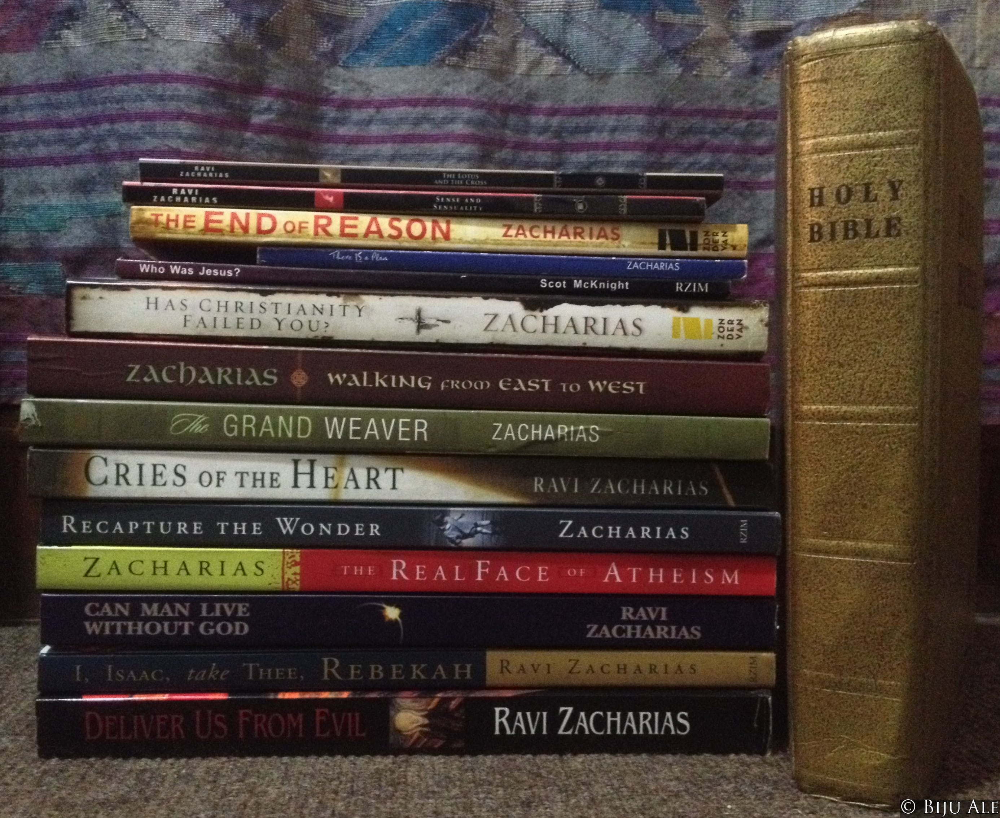

Dear Ravi,

You are my intellectual superhero in Christ, who has had an immense impact on my life. You introduced me to apologetics and the intellectual dimension of faith since my younger days, as of now eight years ago. Nepal, where I come from, though nominally secular recently, has a virtually ubiquitous culture, deeply rooted in the Hindu worldview. We have gone through myriad political and humanitarian upheavals including earthquakes and civil war. And it is no easy to live as a professing follower of Christ in this part of the world. However, no matter the woes, you’ve always been for me the living inspiration from our Father, the Grand Weaver who loves us unconditionally, devises avenues, &amp; uses the modest individuals for his great works, when uncertainties seem overwhelming to us.

Your younger days in Delhi, shared with your beloved pal Sundar Krishnan, the YFC training, the watershed moment with your beloved mother & the 14th chapter from the gospel of John that lead you to leave no stone unturned for Christ in the pursuit of Truth, your solo mission in war-torn Vietnam, your academic journey with Dr. Norm Geisler as your mentor & Dr. William Lane Craig as your classmate, your sabbatical at Cambridge, and lectureships at Oxford, and your incredible 45+ years global journey as an itinerant intellectual altogether with those rods on your back; all these episodes which you shared with unfailing mutual love with your sweetheart Margie, will go down beautifully in the annals of the greatest warriors of God on earth. You are my greatest inspiration and a living example of Philippians 4:13

Your books and podcasts have edified me, illuminated me, and strengthened my faith immensely. I will miss your amusing anecdotes, poignant real-life narratives, pertinent excerpts from some of the greatest works of literature, your intrepid lectures illuminating profound Truths in Christ, the dynamic open forums in the Ivy-Leagues & challenging places, & the Q&As in which you answered the questioner behind the question. You inspired me to cultivate a life of the mind - to become a serious scholar of literary giants, of theology, and philosophy. Moreover, your brilliant eloquence & articulations of philosophical complexities and how marvelously you relate them to our experiences kindled my love for language & philosophy.

You never succumbed to the trials and temptations all those decades planting your soul firmly in God’s word. As you returned home from the long itinerary, you always kissed your kitchen floor and all your life, demonstrated unfailing love for Margie & the kids. This will forever remind me to be modest & grateful to the Lord for my home & my family. You taught me methodical front-line apologetics and how its employment is like the bush clearing to ultimately reveal the beauty of Christ. And that Truth must always be undergirded by Love to lead souls into the kingdom. I will never forget your 3-4-5 Grid Methodology for worldview analysis. Also, Naomi through her Wellspring project always reminds me that as a Christian, our apologetics must be accompanied by our humanitarian response towards the wounded, the vulnerable, & the needy. You expounded to me what worship is and yourself lived out its definition by Archbishop William Temple. And Ravi, one of my greatest lessons from you is how the Cross culminates simultaneously, the Lord’s justice, and his unconditional love for humanity.

I dreamt that one day within our lifetime, I could meet you in person but perhaps God has other ways to make that happen. I am eternally grateful to you dear Ravi, for your life and ministry. You have labored beautifully & fought an exceptional fight as an exemplary ambassador for Christ. Praying for you, Margie, Sarah, Naomi, Nathan, & the RZIM family for health, fortitude, and divine wisdom.

> In death’s dark vale I fear no ill
>
>  
> With thee, dear Lord, beside me;
>  
> Thy rod and staff my comfort still,
>  
> Thy cross before to guide me.
>  
>
>  
> Thou spread’ st a table in my sight;
>  
> Thy unction grace bestoweth;
>  
> And O what transport of delight
>  
> From thy pure chalice floweth!
>  
>  
> And so through all the length of days
>  
> Thy goodness faileth never:
>  
> Good Shepherd, may I sing thy praise
>  
> Within thy house forever.

<cite>HW Baker, 1868</cite>

With Eternal Love,  
Biju Ale

(May 10, 2020  
Kathmandu, Nepal)  
Originally posted on the [(RZIM Forum)](https://bit.ly/ThankURavi)
